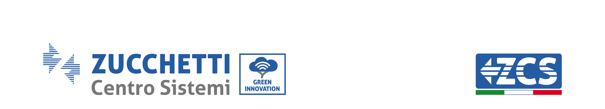

**De#aglio** **nuove** **API**

> • historicData – Permette di recuperare i dati storici giornalieri per
> ogni device (elenco di valori nel tempo, utile per info come
>
> la potenza)
>
> • realtimeData – Permette di recuperare i primi/ultimi valori di ogni
> device (utile per info come ultimo aggiornamento, data
>
> primo pacchetto inviato, valori energetici…)
>
> • deviceHistoricAlarm - Permette di recuperare i dati storici
> giornalieri dello stato di allarme di ogni device (elenco di valori
>
> nel tempo)
>
> • deviceAlarm – Permette di recuperare lo stato attuale di allarme di
> ogni device (utile per conoscere l’ultimo stato di allarme
>
> degli inverter, tramite la data dell’ultimo pacchetto ricevuto, ed i
> relativi ID di allarme attivi in quel momento)

All’interno delle richieste sara necessario inserire il campo “client”,
ad ogni nuovo cliente che effettuera richieste API sara assegnato e
comunicato da ZCS un codice identiIicativo.

Inoltre tutte le richieste dovranno essere autenticate, e pertanto dovra
essere presente, negli headers, il parametro 'Authorization', con valore
uguale a 'Zcs eHWAeEq0aYO0'.

L’indirizzo verso il quale effettuare le richieste POST e:
[**<u>https://third.zcsazzurroportal.com:19003/</u>**](https://third.zcsazzurroportal.com:19003/)

> application/json
>
> 1 / 15
>
> Zucchetti Centro Sistemi S.p.A. - Green Innovation Division
>
> Via Lungarno, 248 - 52028 Terranuova Bracciolini - Arezzo, Italy tel.
> +39 055 91971 - fax. +39 055 9197515
>
> innovation@zcscompany.com - zcs@pec.it – **www.zcsazzurro.com**
>
>  style="width:0.52639in;height:0.25208in" />Reg. Pile
> IT12110P00002965 - Capitale Sociale € 100.000,00 I.V. Reg. Impr. AR
> n.03225010481 - REAAR - 94189
>
> Azienda Certificata ISO 9001 - Certificato n. 9151 - CNS0 - IT-17778

**1.**
**Richiesta** **historicData**

La nuova richiesta historicData avra una struttura simile alla seguente:

**{**

> **"historicData":** **{** **"command":** **"historicData",**
> **"params":** **{**
>
> **"thingKey":** **"ZA1ES111H1C029,** **ZE1ES330M3E696,**
> **ZP1ES010L68003,** **2612280094",** **"requiredValues":** **"\*",**
>
> **"start":** **"2021-09-15T00:00:00.000Z",** **"end":**
> **"2021-09-15T23:59:59.059Z"**
>
> **}** **}**

**}**

I campi “start” e “end” saranno entrambi **OBBLIGATORI** e la distanza
tra i 2 valori dovra essere di **max** **24** **ore**.

La lista di requiredValues disponibili sara la seguente: •
batteryCycletime

> • batterySoC
>
> • powerCharging
>
> • powerDischarging • powerExporting
>
> • powerImporting • powerConsuming
>
> • powerAutoconsuming • powerGenerating
>
> • powerGeneratingExt • energyCharging
>
> 2 / 15
>
> Zucchetti Centro Sistemi S.p.A. - Green Innovation Division
>
> Via Lungarno, 248 - 52028 Terranuova Bracciolini - Arezzo, Italy tel.
> +39 055 91971 - fax. +39 055 9197515
>
> innovation@zcscompany.com - zcs@pec.it – **www.zcsazzurro.com**
>
>  style="width:0.52431in;height:0.24653in" />Reg. Pile
> IT12110P00002965 - Capitale Sociale € 100.000,00 I.V. Reg. Impr. AR
> n.03225010481 - REAAR - 94189
>
> Azienda Certificata ISO 9001 - Certificato n. 9151 - CNS0 - IT-17778
>
> •
> energyDischarging • energyExporting
>
> • energyImporting • energyConsuming
>
> • energyAutoconsuming • energyGenerating
>
> • currentAC • voltageAC • powerDC • currentDC • voltageDC • frequency
>
> • temperature
>
> • energyChargingTotal
>
> • energyDischargingTotal • energyExportingTotal
>
> • energyImportingTotal • energyConsumingTotal • energyGeneratingTotal
>
> • energyChargingTotalDecimal
>
> • energyDischargingTotalDecimal • energyExportingTotalDecimal
>
> • energyImportingTotalDecimal • energyConsumingTotalDecimal •
> energyGeneratingTotalDecimal
>
> • **\*** **(INDICA** **ELENCO** **DI** **TUTTI** **I** **VALORI**
> **PRECEDENTI)**
>
> 3 / 15
>
> Zucchetti Centro Sistemi S.p.A. - Green Innovation Division
>
> Via Lungarno, 248 - 52028 Terranuova Bracciolini - Arezzo, Italy tel.
> +39 055 91971 - fax. +39 055 9197515
>
> innovation@zcscompany.com - zcs@pec.it – **www.zcsazzurro.com**
>
>  style="width:0.52431in;height:0.24653in" />Reg. Pile
> IT12110P00002965 - Capitale Sociale € 100.000,00 I.V. Reg. Impr. AR
> n.03225010481 - REAAR - 94189
>
> Azienda Certificata ISO 9001 - Certificato n. 9151 - CNS0 - IT-17778

La risposta sara come la seguente:

**{**

> **"historicData":** **{** **"params":** **{**
>
> **"value":** **\[** **{**
>
> **"ZA1ES111H1C029":** **{** **"powerGenerating":** **\[…\],**
> **"ts":** **\[…\],** **"energyGenerating":** **\[…\],**
>
> **"energyGeneratingTotal":** **\[…\]** **}**
>
> **},** **{**
>
> **"ZE1ES330M3E696":** **{** **"powerConsuming":** **\[…\],**
> **"powerImporting":** **\[…\],** **"energyGenerating":** **\[…\],**
> **"energyExporting":** **\[…\],** **"ts":** **\[…\],**
>
> **"energyAutoconsuming":** **\[…\],** **"energyDischarging":**
> **\[…\],** **"energyConsuming":** **\[…\],** **"energyImporting":**
> **\[…\],** **"powerDischarging":** **\[…\],** **"energyCharging":**
> **\[…\],** **"batterySoC":** **\[…\],** **"powerCharging":**
> **\[…\],**
>
> 4 / 15
>
> Zucchetti Centro Sistemi S.p.A. - Green Innovation Division
>
> Via Lungarno, 248 - 52028 Terranuova Bracciolini - Arezzo, Italy tel.
> +39 055 91971 - fax. +39 055 9197515
>
> innovation@zcscompany.com - zcs@pec.it – **www.zcsazzurro.com**
>
>  style="width:0.52431in;height:0.24653in" />Reg. Pile
> IT12110P00002965 - Capitale Sociale € 100.000,00 I.V. Reg. Impr. AR
> n.03225010481 - REAAR - 94189
>
> Azienda Certificata ISO 9001 - Certificato n. 9151 - CNS0 - IT-17778
>
> **"powerGenerating":**
> **\[…\],** **"powerAutoconsuming":** **\[…\],** **"powerExporting":**
> **\[…\],** **"batteryCycletime":** **\[…\],**
> **"energyGeneratingTotal":** **\[…\],** **"energyExportingTotal":**
> **\[…\],** **"energyDischargingTotal":** **\[…\],**
> **"energyConsumingTotal":** **\[…\],** **"energyImportingTotal":**
> **\[…\],** **"energyChargingTotal":** **\[…\]**
>
> **}** **},**
>
> **{**
>
> **"ZP1ES010L68003":** **{** **"powerConsuming":** **\[…\],**
> **"powerImporting":** **\[…\],** **"energyGenerating":** **\[…\],**
> **"batterySoC2":** **\[…\],** **"energyExporting":** **\[…\],**
> **"batteryCycletime2":** **\[…\]** **"ts":** **\[…\],**
> **"energyAutoconsuming":** **\[…\],** **"energyDischarging":**
> **\[…\],** **"energyConsuming":** **\[…\],** **"energyImporting":**
> **\[…\],** **"powerDischarging":** **\[…\],** **"energyCharging":**
> **\[…\],** **"batterySoC":** **\[…\],** **"powerCharging":**
> **\[…\],** **"powerGenerating":** **\[…\],** **"powerAutoconsuming":**
> **\[…\],**
>
> 5 / 15
>
> Zucchetti Centro Sistemi S.p.A. - Green Innovation Division
>
> Via Lungarno, 248 - 52028 Terranuova Bracciolini - Arezzo, Italy tel.
> +39 055 91971 - fax. +39 055 9197515
>
> innovation@zcscompany.com - zcs@pec.it – **www.zcsazzurro.com**
>
>  style="width:0.52431in;height:0.24653in" />Reg. Pile
> IT12110P00002965 - Capitale Sociale € 100.000,00 I.V. Reg. Impr. AR
> n.03225010481 - REAAR - 94189
>
> Azienda Certificata ISO 9001 - Certificato n. 9151 - CNS0 - IT-17778
>
> **"powerExporting":**
> **\[…\],** **"batteryCycletime":** **\[…\],**
> **"energyGeneratingTotal":** **\[…\],** **"energyExportingTotal":**
> **\[…\],**
>
> **"energyDischargingTotal":** **\[…\],** **"energyConsumingTotal":**
> **\[…\],** **"energyImportingTotal":** **\[…\],**
> **"energyChargingTotal":** **\[…\]**
>
> **}** **},**
>
> **{**
>
> **"2612280094":** **{** **"powerImporting":** **\[…\],**
> **"energyExporting":** **\[…\],** **"ts":** **\[…\],**
> **"energyImporting":** **\[…\],** **"powerExporting":** **\[…\],**
>
> **}** **}**
>
> **\]** **},**
>
> **"success":** **true** **}**

**}**

Per ogni tipologia di device, tra i valori presenti in requiredValues,
saranno presenti soltanto i valori delle misure compatibili col device.

> 6 / 15
>
> Zucchetti Centro Sistemi S.p.A. - Green Innovation Division
>
> Via Lungarno, 248 - 52028 Terranuova Bracciolini - Arezzo, Italy tel.
> +39 055 91971 - fax. +39 055 9197515
>
> innovation@zcscompany.com - zcs@pec.it – **www.zcsazzurro.com**
>
>  style="width:0.52431in;height:0.24653in" />Reg. Pile
> IT12110P00002965 - Capitale Sociale € 100.000,00 I.V. Reg. Impr. AR
> n.03225010481 - REAAR - 94189
>
> Azienda Certificata ISO 9001 - Certificato n. 9151 - CNS0 - IT-17778

**2.**
**Richiesta** **real9meData**

La nuova richiesta realtimeData avra una struttura simile alla seguente:

**{**

> **"realtimeData":** **{** **"command":** **"realtimeData",**
> **"params":** **{**
>
> **"thingKey":** **"ZA1ES111H1C029,** **ZE1ES330M3E696,**
> **ZP1ES010L68003,** **2612280094** **",** **"requiredValues":**
> **"\*"**
>
> **}** **}**

**}**

La lista di requiredValues disponibili sara la seguente: • lastUpdate

> • thingFind
>
> • batteryCycletime • batterySoC
>
> • powerCharging
>
> • powerDischarging • powerExporting
>
> • powerImporting • powerConsuming
>
> • powerAutoconsuming • powerGenerating
>
> • powerGeneratingExt • energyCharging
>
> • energyDischarging
>
> 7 / 15
>
> Zucchetti Centro Sistemi S.p.A. - Green Innovation Division
>
> Via Lungarno, 248 - 52028 Terranuova Bracciolini - Arezzo, Italy tel.
> +39 055 91971 - fax. +39 055 9197515
>
> innovation@zcscompany.com - zcs@pec.it – **www.zcsazzurro.com**
>
>  style="width:0.52431in;height:0.24653in" />Reg. Pile
> IT12110P00002965 - Capitale Sociale € 100.000,00 I.V. Reg. Impr. AR
> n.03225010481 - REAAR - 94189
>
> Azienda Certificata ISO 9001 - Certificato n. 9151 - CNS0 - IT-17778
>
> •
> energyExporting • energyImporting • energyConsuming
>
> • energyAutoconsuming • energyGenerating
>
> • energyChargingTotal
>
> • energyDischargingTotal • energyExportingTotal
>
> • energyImportingTotal • energyConsumingTotal
>
> • energyAutoconsumingTotal • energyGeneratingTotal

• **\*** **(INDICA** **ELENCO** **DI** **TUTTI** **I** **VALORI**
**PRECEDENTI)** La risposta sara come la seguente:

**{**

> **"realtimeData":** **{** **"params":** **{**
>
> **"value":** **\[** **{**
>
> **"ZA1ES111H1C029":** **{** **"powerGenerating":** **490,**
> **"energyGenerating":** **0.8,** **"energyGeneratingTotal":**
> **3874,** **"thingFind":** **"2019-02-01T08:51:48Z",**
> **"lastUpdate":** **"2022-01-10T09:53:13Z"**
>
> **}** **},**
>
> 8 / 15
>
> Zucchetti Centro Sistemi S.p.A. - Green Innovation Division
>
> Via Lungarno, 248 - 52028 Terranuova Bracciolini - Arezzo, Italy tel.
> +39 055 91971 - fax. +39 055 9197515
>
> innovation@zcscompany.com - zcs@pec.it – **www.zcsazzurro.com**
>
>  style="width:0.52431in;height:0.24653in" />Reg. Pile
> IT12110P00002965 - Capitale Sociale € 100.000,00 I.V. Reg. Impr. AR
> n.03225010481 - REAAR - 94189
>
> Azienda Certificata ISO 9001 - Certificato n. 9151 - CNS0 - IT-17778
>
> **{**
>
> **"ZE1ES330M3E696":** **{** **"powerConsuming":** **800,**
>
> **"thingFind":** **"2021-04-29T12:23:20Z",**
> **"energyAutoconsuming":** **0.57,** **"energyAutoconsumingTotal":**
> **1942,** **"batteryCycletime":** **161,** **"energyImportingTotal":**
> **2053,** **"energyCharging":** **0,** **"energyGeneratingTotal":**
> **3572,** **"energyExportingTotal":** **814,**
> **"energyChargingTotal":** **816,** **"powerAutoconsuming":** **570,**
> **"lastUpdate":** **"2022-01-10T09:44:11Z",** **"powerExporting":**
> **0,** **"powerGenerating":** **570,** **"energyImporting":** **4.7,**
> **"powerImporting":** **230,** **"energyGenerating":** **0.57,**
> **"energyDischargingTotal":** **769,** **"energyDischarging":**
> **0.12,** **"energyConsuming":** **5.39,** **"energyExporting":**
> **0,** **"energyConsumingTotal":** **4764,** **"batterySoC":** **17,**
>
> **"powerCharging":** **0,** **"powerDischarging":** **0**
>
> **}** **},**
>
> **{**
>
> **"ZP1ES010L68003":** **{**
>
> 9 / 15
>
> Zucchetti Centro Sistemi S.p.A. - Green Innovation Division
>
> Via Lungarno, 248 - 52028 Terranuova Bracciolini - Arezzo, Italy tel.
> +39 055 91971 - fax. +39 055 9197515
>
> innovation@zcscompany.com - zcs@pec.it – **www.zcsazzurro.com**
>
>  style="width:0.52431in;height:0.24653in" />Reg. Pile
> IT12110P00002965 - Capitale Sociale € 100.000,00 I.V. Reg. Impr. AR
> n.03225010481 - REAAR - 94189
>
> Azienda Certificata ISO 9001 - Certificato n. 9151 - CNS0 - IT-17778
>
> **"powerConsuming":**
> **4171,** **"thingFind":** **"2020-11-04T08:42:51Z",**
> **"energyAutoconsuming":** **10.54,**
>
> **"energyAutoconsumingTotal":** **16371.8,** **"batteryCycletime":**
> **0,** **"energyImportingTotal":** **0,** **"energyCharging":** **0,**
> **"energyGeneratingTotal":** **16371.8,** **"energyExportingTotal":**
> **0,** **"batterySoC2":** **0,** **"powerAutoconsuming":** **4171,**
> **"lastUpdate":** **"2022-01-10T09:49:43Z",** **"powerExporting":**
> **0,** **"powerGenerating":** **4171,** **"energyImporting":** **0,**
> **"powerImporting":** **0,** **"energyGenerating":** **10.54,**
> **"batteryCycletime2":** **0,** **"energyDischargingTotal":** **0,**
> **"energyDischarging":** **0,** **"energyConsuming":** **10.54,**
> **"energyExporting":** **0,** **"energyConsumingTotal":** **16371.8,**
> **"batterySoC":** **0,**
>
> **"powerCharging":** **0,** **"powerDischarging":** **0,**
> **"energyChargingTotal":** **0**
>
> **}** **},**
>
> **{**
>
> **"2612280094":** **{**
>
> 10 / 15
>
> Zucchetti Centro Sistemi S.p.A. - Green Innovation Division
>
> Via Lungarno, 248 - 52028 Terranuova Bracciolini - Arezzo, Italy tel.
> +39 055 91971 - fax. +39 055 9197515
>
> innovation@zcscompany.com - zcs@pec.it – **www.zcsazzurro.com**
>
>  style="width:0.52431in;height:0.24653in" />Reg. Pile
> IT12110P00002965 - Capitale Sociale € 100.000,00 I.V. Reg. Impr. AR
> n.03225010481 - REAAR - 94189
>
> Azienda Certificata ISO 9001 - Certificato n. 9151 - CNS0 - IT-17778
>
> **"energyExporting":**
> **3601.65,** **"powerImporting":** **0,**
>
> **"thingFind":** **"2021-02-23T15:10:39Z",** **"energyImporting":**
> **2.01,** **"energyImportingTotal":** **2.01,** **"powerExporting":**
> **171,** **"energyExportingTotal":** **3601.65,** **"lastUpdate":**
> **"2022-01-10T09:49:31Z"**
>
> **}** **}**
>
> **\]** **},**
>
> **"success":** **true** **}**

**}**

Per ogni tipologia di device, tra i valori presenti in requiredValues,
saranno presenti soltanto i valori delle misure compatibili col device.

> 11 / 15
>
> Zucchetti Centro Sistemi S.p.A. - Green Innovation Division
>
> Via Lungarno, 248 - 52028 Terranuova Bracciolini - Arezzo, Italy tel.
> +39 055 91971 - fax. +39 055 9197515
>
> innovation@zcscompany.com - zcs@pec.it – **www.zcsazzurro.com**
>
>  style="width:0.52431in;height:0.24653in" />Reg. Pile
> IT12110P00002965 - Capitale Sociale € 100.000,00 I.V. Reg. Impr. AR
> n.03225010481 - REAAR - 94189
>
> Azienda Certificata ISO 9001 - Certificato n. 9151 - CNS0 - IT-17778

**3.**
**Richiesta** **deviceHistoricAlarm**

La nuova richiesta deviceHistoricAlarm avra una struttura simile alla
seguente:

**{**

> **"deviceHistoricAlarm":** **{** **"command":**
> **"deviceHistoricAlarm",** **"params":** **{**
>
> **"thingKey":** **"ZA1ES122JAH761,** **ZE1ES330M3E696,**
> **ZP1ES010L68003,** **2612280094",** **"requiredValues":** **"\*",**
>
> **"start":** **"2021-09-15T00:00:00.000Z",** **"end":**
> **"2021-09-15T23:59:59.059Z"**
>
> **}** **}**

**}**

La lista di requiredValues disponibili sara la seguente: • lastUpdate

> • deviceAlarm
>
> • **\*** **(INDICA** **ELENCO** **DI** **TUTTI** **I** **VALORI**
> **PRECEDENTI)**

La risposta sara come la seguente:

**{**

> **"deviceHistoricAlarm":** **{** **"success":** **true,**
> **"params":** **{**
>
> **"value":** **\[** **{**
>
> **"ZA1ES122JAH761":** **{** **"deviceAlarm":** **\[…\],**
>
> 12 / 15
>
> Zucchetti Centro Sistemi S.p.A. - Green Innovation Division
>
> Via Lungarno, 248 - 52028 Terranuova Bracciolini - Arezzo, Italy tel.
> +39 055 91971 - fax. +39 055 9197515
>
> innovation@zcscompany.com - zcs@pec.it – **www.zcsazzurro.com**
>
>  style="width:0.52431in;height:0.24653in" />Reg. Pile
> IT12110P00002965 - Capitale Sociale € 100.000,00 I.V. Reg. Impr. AR
> n.03225010481 - REAAR - 94189
>
> Azienda Certificata ISO 9001 - Certificato n. 9151 - CNS0 - IT-17778
>
> **"ts":**
> **\[…\]** **}**
>
> **},** **{**
>
> **"ZE1ES330M3E696":** **{** **"deviceAlarm":** **\[…\],** **"ts":**
> **\[…\]**
>
> **}** **},**
>
> **{**
>
> **"ZP1ES010L68003":** **{** **"deviceAlarm":** **\[…\],** **"ts":**
> **\[…\]**
>
> **}** **},**
>
> **{**
>
> **"2612280094":** **{}** **}**
>
> **\]** **}**
>
> **}**

Per ogni tipologia di device, tra i valori presenti in requiredValues,
saranno presenti soltanto i valori delle misure compatibili col device.

> 13 / 15
>
> Zucchetti Centro Sistemi S.p.A. - Green Innovation Division
>
> Via Lungarno, 248 - 52028 Terranuova Bracciolini - Arezzo, Italy tel.
> +39 055 91971 - fax. +39 055 9197515
>
> innovation@zcscompany.com - zcs@pec.it – **www.zcsazzurro.com**
>
>  style="width:0.52431in;height:0.24653in" />Reg. Pile
> IT12110P00002965 - Capitale Sociale € 100.000,00 I.V. Reg. Impr. AR
> n.03225010481 - REAAR - 94189
>
> Azienda Certificata ISO 9001 - Certificato n. 9151 - CNS0 - IT-17778

**4.**
**Richiesta** **deviceAlarm**

La nuova richiesta deviceAlarm avra una struttura simile alla seguente:

**{**

> **"deviceAlarm":** **{** **"command":** **"deviceAlarm",**
> **"params":** **{**
>
> **"thingKey":** **"ZA1ES122JAH761,** **ZE1ES330M3E696,**
> **ZP1ES010L68003,** **2612280094",** **"requiredValues":** **"\*"**
>
> **}** **}**

**}**

La lista di requiredValues disponibili sara la seguente: • lastUpdate

> • deviceAlarm
>
> • **\*** **(INDICA** **ELENCO** **DI** **TUTTI** **I** **VALORI**
> **PRECEDENTI)**

La risposta sara come la seguente:

**{**

> **"** **deviceAlarm":** **{** **"params":** **{**
>
> **"value":** **\[** **{**
>
> **"ZA1ES122JAH761":** **{** **"deviceAlarm":** **\[**
>
> **2,** **4**
>
> **\],**
>
> **"lastUpdate":** **"2022-10-24T09:32:49Z"**
>
> 14 / 15
>
> Zucchetti Centro Sistemi S.p.A. - Green Innovation Division
>
> Via Lungarno, 248 - 52028 Terranuova Bracciolini - Arezzo, Italy tel.
> +39 055 91971 - fax. +39 055 9197515
>
> innovation@zcscompany.com - zcs@pec.it – **www.zcsazzurro.com**
>
>  style="width:0.52431in;height:0.24653in" />Reg. Pile
> IT12110P00002965 - Capitale Sociale € 100.000,00 I.V. Reg. Impr. AR
> n.03225010481 - REAAR - 94189
>
> Azienda Certificata ISO 9001 - Certificato n. 9151 - CNS0 - IT-17778
>
> **}**
> **},**
>
> **{**
>
> **"ZE1ES330M3E696":** **{** **"deviceAlarm":** **\[\],**
>
> **"lastUpdate":** **"2022-10-24T09:46:03Z"** **}**
>
> **},** **{**
>
> **"ZP1ES010L68003":** **{** **"deviceAlarm":** **\[\],**
>
> **"lastUpdate":** **"2022-02-28T08:27:56Z"** **}**
>
> **},** **{**
>
> **"2612280094":** **{}** **}**
>
> **\]** **},**
>
> **"success":** **true** **}}**

Per ogni tipologia di device, tra i valori presenti in requiredValues,
saranno presenti soltanto i valori delle misure compatibili col device.

> 15 / 15
>
> Zucchetti Centro Sistemi S.p.A. - Green Innovation Division
>
> Via Lungarno, 248 - 52028 Terranuova Bracciolini - Arezzo, Italy tel.
> +39 055 91971 - fax. +39 055 9197515
>
> innovation@zcscompany.com - zcs@pec.it – **www.zcsazzurro.com**
>
>  style="width:0.52431in;height:0.24653in" />Reg. Pile
> IT12110P00002965 - Capitale Sociale € 100.000,00 I.V. Reg. Impr. AR
> n.03225010481 - REAAR - 94189
>
> Azienda Certificata ISO 9001 - Certificato n. 9151 - CNS0 - IT-17778
